<div align="center">

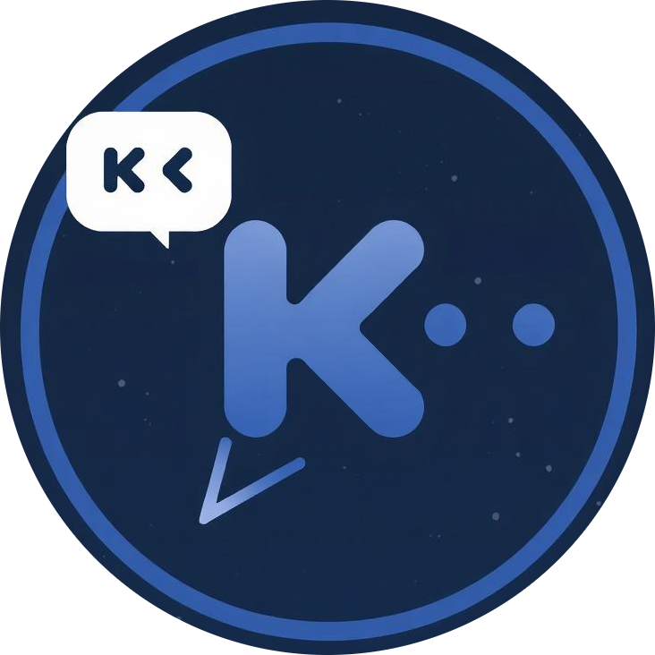

# KChat

### 🚀 From Chat to Context

**Real-Time Communication × Context Intelligence × Modern Android**

<br/>

<a href="https://github.com/programmer-kunal/KChat">

</a>
<a href="https://kotlinlang.org/">

</a>
<a href="https://developer.android.com/jetpack/compose">

</a>
<a href="https://firebase.google.com/">

</a>
<a href="https://firebase.google.com/docs/ai-logic">

</a>
<a href="https://ai.google.dev/">

</a>

<br/>

<a href="https://www.zegocloud.com/">

</a>
<a href="https://supabase.com/">

</a>
<a href="https://developer.android.com/topic/architecture">

</a>

<br/>

### 💬 Real-Time Communication + 🤖 Contextual AI

<p>
KChat combines <b>real-time messaging, multimedia communication,
calling, and contextual AI assistance</b> in a modern Android application.
</p>

<p>
<b>Don't just deliver the conversation. Understand the conversation.</b>
</p>

<br/>

<a href="https://drive.google.com/drive/folders/1RB-iQOIvo52ucmvXW4rn5lG9Vo4NQUrR">

</a>

<br/>

<sub>Signed Release APK • arm64-v8a • Firebase App Check • reCAPTCHA Enterprise</sub>

</div>

---

# 🌟 From Chat to Context

Traditional messaging follows:

```text
Send → Receive → Reply
```

KChat extends this into:

```text
Send → Understand → Assist → Communicate
```

A conversation can contain context, intent, sentiment, decisions, tasks, deadlines, and security signals.

KChat adds an intelligence layer directly inside the communication workflow.

---

# 🧠 KChat AI

## Four AI Features. One Conversation.

<div align="center">

<table width="100%">
<tr>

<td align="center" width="25%">

### 🤖 Smart Reply

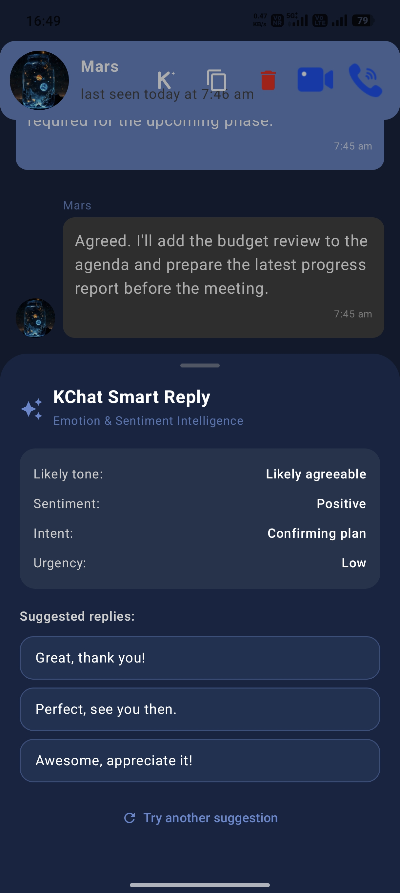

</td>

<td align="center" width="25%">

### 📝 Thread Summary


</td>

<td align="center" width="25%">

### 🔎 Context Search

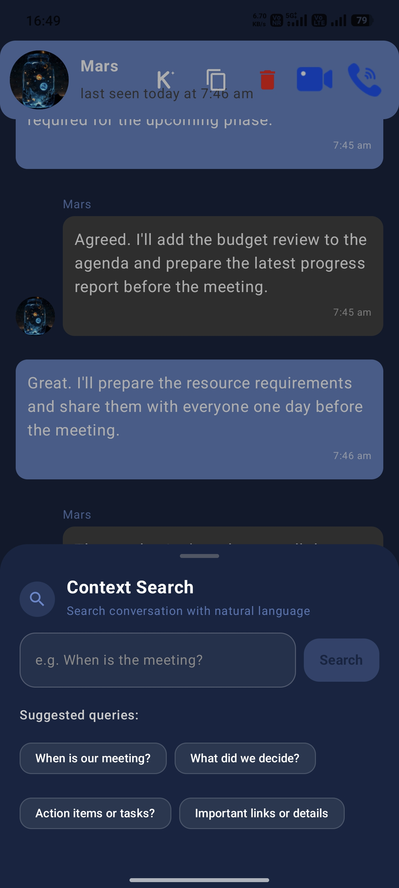

</td>

<td align="center" width="25%">

### 🛡️ Scam Guard

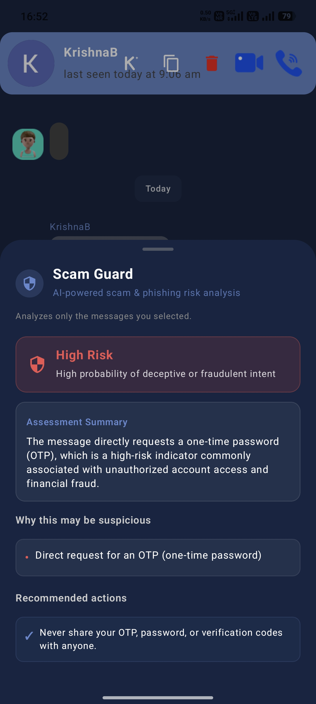

</td>

</tr>
</table>

</div>

---

# 🤖 Smart Reply

KChat Smart Reply is an on-demand AI assistant for one-to-one conversations.

It analyzes selected messages for:

- 🎭 Tone
- 😊 Sentiment
- 🎯 Intent
- ⚡ Urgency
- 💬 Conversation context

It then generates context-aware reply suggestions.

```text
Select Messages
      ↓
Smart Reply
      ↓
Firebase AI Logic
      ↓
Gemini 3.5 Flash-Lite
      ↓
Tone • Sentiment • Intent • Urgency
      ↓
Reply Suggestions
      ↓
User Reviews / Edits
      ↓
Manual Send
```

**Human-in-the-loop:** KChat never automatically sends an AI-generated reply.

---

# 📝 Thread Summary

Thread Summary helps users understand long conversations without manually reading every message again.

It focuses on:

```text
📌 Key Points
✅ Decisions
📝 Tasks
📅 Deadlines
⭐ Important Details
```

The result is a concise, structured summary of the selected conversation.

---

# 🔎 Context Search

Context Search helps retrieve relevant information from a conversation based on meaning and context.

Instead of searching only for exact words, users can ask questions such as:

```text
"When do we need to complete the project?"
"Who was responsible for the presentation?"
"What decision did we make about the meeting?"
```

```text
Conversation
     ↓
Context Preparation
     ↓
AI Analysis
     ↓
Relevant Messages
     ↓
Validated Results
     ↓
Jump to Original Message
```

<div align="center">

<table>
<tr>

<td align="center">


<br/>

<sub>Context Search</sub>

</td>

<td align="center">

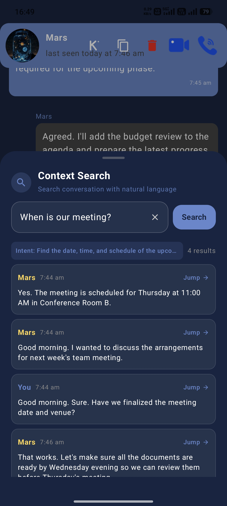

<br/>

<sub>Search Results</sub>

</td>

</tr>
</table>

</div>

---

# 🛡️ Scam Guard

Scam Guard provides AI-assisted analysis of selected messages.

It looks for indicators such as:

- Suspicious links
- Urgent requests
- Credential requests
- Financial requests
- Phishing patterns
- Impersonation-style communication

```text
Select Message
      ↓
Scam Guard
      ↓
AI Risk Analysis
      ↓
Risk Level
      ↓
Indicators + Explanation
      ↓
Recommendations
```

Scam Guard is user-triggered and works as an additional layer of communication awareness.

---

# ✨ The KChat AI Layer

```text
                         KCHAT AI
                            │
        ┌───────────────────┼───────────────────┐
        │                   │                   │
        ▼                   ▼                   ▼
   🤖 Smart Reply     📝 Thread Summary    🔎 Context Search
        │                   │                   │
        └───────────────────┼───────────────────┘
                            │
                            ▼
                       🛡️ Scam Guard
                            │
                            ▼
                     👤 User Assistance
```

| Feature | Purpose |
|---|---|
| 🤖 **Smart Reply** | Generate context-aware response suggestions |
| 📝 **Thread Summary** | Extract important information from conversations |
| 🔎 **Context Search** | Retrieve relevant conversational information |
| 🛡️ **Scam Guard** | Identify possible scam and phishing indicators |

---

# 💬 Core Communication

KChat provides a complete real-time communication foundation:

- 🔐 Firebase Authentication
- 💬 One-to-one messaging
- 👥 Group chat
- 👤 Friend discovery and requests
- 🟢 Online/offline presence
- ✅ Read receipts
- 🔁 Swipe-to-reply and quoted replies
- 🔔 Push notifications
- 📞 Voice calling
- 📹 Video calling

---

# 📎 Media & Attachments

KChat supports:

```text
📷 Images
🎤 Voice Messages
🎥 Video Messages
📎 Documents / Files
```

<div align="center">

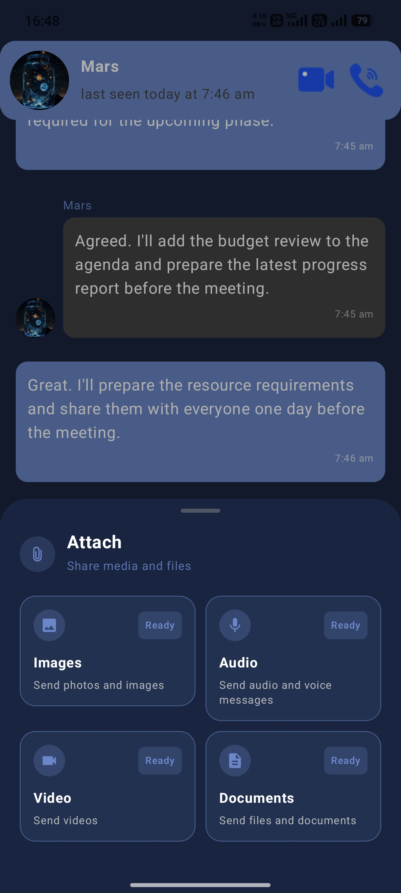

<br/>

<sub>Unified Attachment Interface</sub>

</div>

---

# 🏗️ Application Architecture

KChat follows a modular Android architecture based on:

**Jetpack Compose + MVVM + Coroutines + Flow + Firebase + Supabase + Firebase AI Logic + ZEGOCLOUD**

<div align="center">

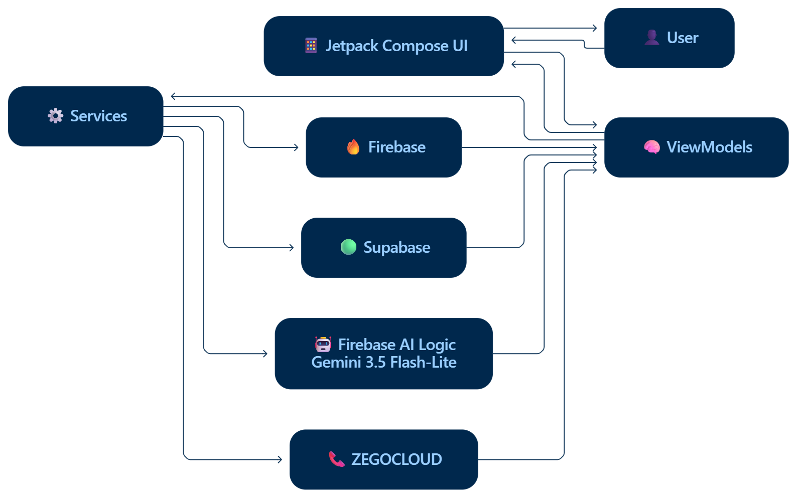

<br/>

<b>Application Architecture</b>

</div>

### Main Layers

| Layer | Purpose |
|---|---|
| 📱 **Compose UI** | Chat, media, attachment and AI interfaces |
| 🧠 **ViewModels** | State management and application logic |
| ⚙️ **Services** | Communication, storage, AI and calling |
| 🔥 **Firebase** | Authentication, real-time database and notifications |
| 🟢 **Supabase** | Media and file storage |
| 🤖 **Firebase AI Logic + Gemini** | AI processing |
| 📞 **ZEGOCLOUD** | Real-time audio/video calling |

---

# 🤖 AI Architecture

The AI system is based on **user-selected conversation context**.

<div align="center">

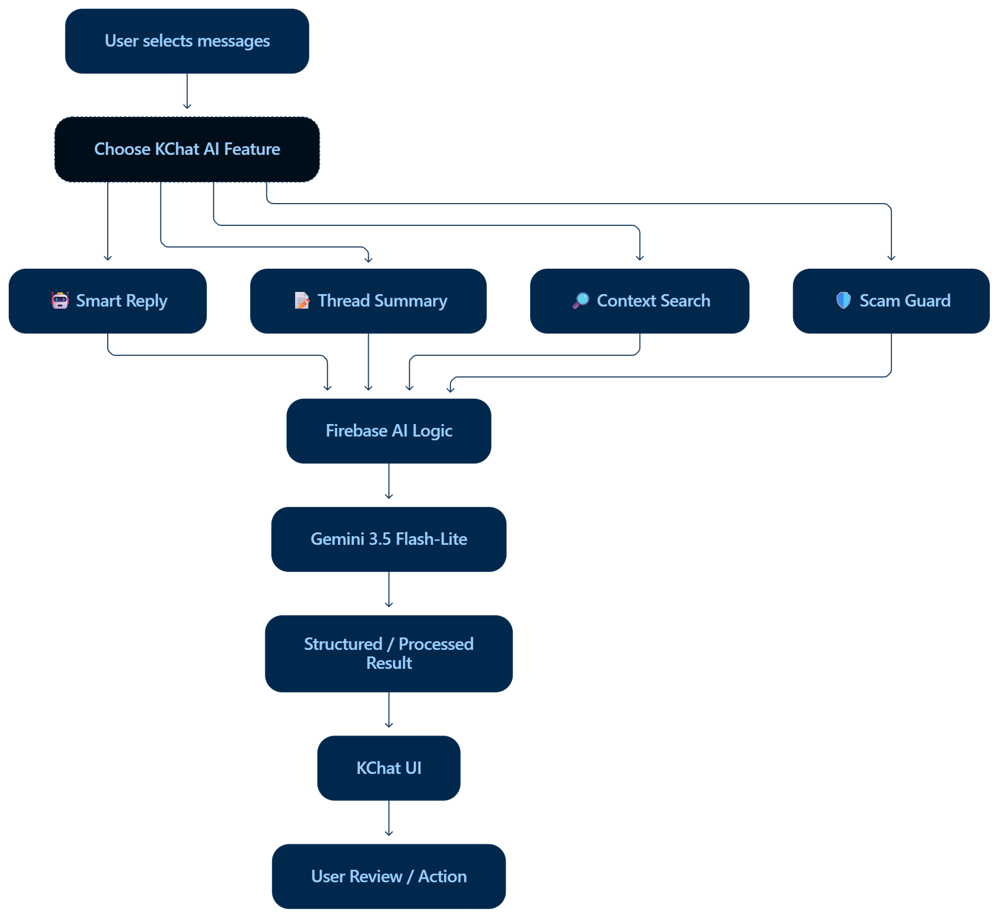

<br/>

<b>Context Intelligence Architecture</b>

</div>

```text
User
 │
 ▼
Selects Relevant Messages
 │
 ▼
Chooses AI Feature
 │
 ├──► 🤖 Smart Reply
 ├──► 📝 Thread Summary
 ├──► 🔎 Context Search
 └──► 🛡️ Scam Guard
          │
          ▼
   Firebase AI Logic
          │
          ▼
  Gemini 3.5 Flash-Lite
          │
          ▼
      AI Result
          │
          ▼
       KChat UI
          │
          ▼
     User Action
```

---

# 🛠️ Technology Stack

| Layer | Technologies |
|---|---|
| **Platform** | Android |
| **Language** | Kotlin |
| **UI** | Jetpack Compose + Material 3 |
| **Architecture** | MVVM + Coroutines + Flow / StateFlow |
| **Authentication** | Firebase Authentication |
| **Database** | Firebase Realtime Database |
| **Notifications** | Firebase Cloud Messaging |
| **AI Platform** | Firebase AI Logic |
| **AI Model** | Gemini 3.5 Flash-Lite |
| **Storage** | Supabase Storage |
| **Calling** | ZEGOCLOUD |
| **Image Loading** | Coil |
| **Dependency Injection** | Hilt |
| **Security** | Firebase App Check + reCAPTCHA Enterprise |
| **Build** | Gradle + R8 |
| **Version Control** | Git + GitHub |

---

# 🔐 Security & Responsible AI

KChat follows a controlled AI approach.

```text
AI Suggests
     ↓
User Reviews
     ↓
User Edits
     ↓
User Decides
     ↓
Manual Action
```

### Security Principles

- ✅ No automatic AI message sending
- ✅ AI features are user-triggered
- ✅ No continuous background AI scanning
- ✅ No Gemini developer API key embedded in the application
- ✅ Firebase App Check protection
- ✅ Release builds use reCAPTCHA Enterprise
- ✅ User remains in control

---

# ✅ Current Feature Status

| Feature | Status |
|---|:---:|
| Firebase Authentication | ✅ |
| One-to-One Chat | ✅ |
| Group Chat | ✅ |
| Friend System | ✅ |
| Presence / Last Seen | ✅ |
| Read Receipts | ✅ |
| Message Replies | ✅ |
| Image Messaging | ✅ |
| Audio Messaging | ✅ |
| Video Messaging | ✅ |
| Document / File Messaging | ✅ |
| Voice Calling | ✅ |
| Video Calling | ✅ |
| Push Notifications | ✅ |
| 🤖 Smart Reply | ✅ |
| 📝 Thread Summary | ✅ |
| 🔎 Context Search | ✅ |
| 🛡️ Scam Guard | ✅ |
| Firebase App Check | ✅ |
| Signed Release APK | ✅ |

---

# 📸 KChat Screenshots

<details>
<summary><b>🔐 Authentication & User Features</b></summary>

<br/>

<div align="center">

<table>
<tr>

<td align="center">

<br/>
<sub>Login</sub>
</td>

<td align="center">
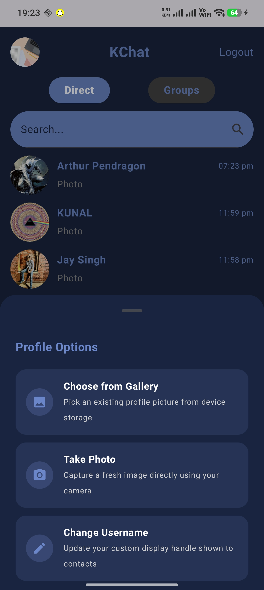
<br/>
<sub>Profile</sub>
</td>

<td align="center">

<br/>
<sub>Add Friend</sub>
</td>

<td align="center">
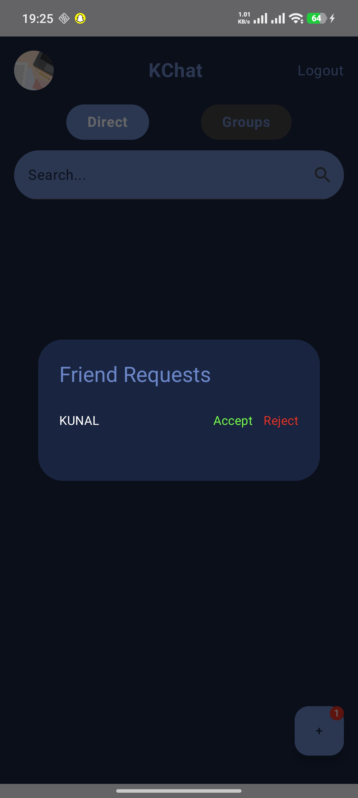
<br/>
<sub>Friend Requests</sub>
</td>

</tr>
</table>

</div>

</details>

<details>
<summary><b>💬 Communication & Chat</b></summary>

<br/>

<div align="center">

<table>
<tr>

<td align="center">
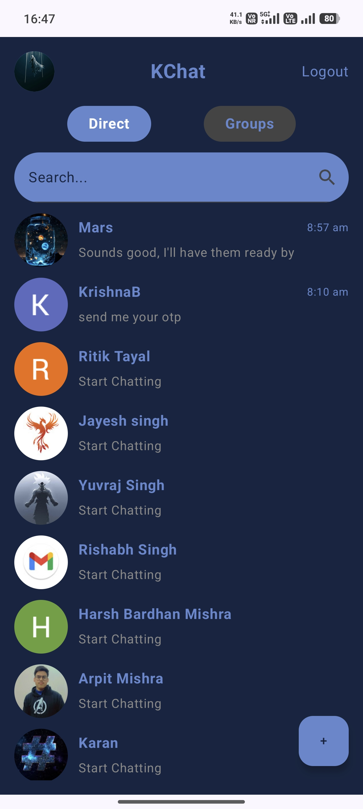
<br/>
<sub>Direct Chat Home</sub>
</td>

<td align="center">

<br/>
<sub>Conversation Home</sub>
</td>

<td align="center">

<br/>
<sub>Personal Chat</sub>
</td>

<td align="center">
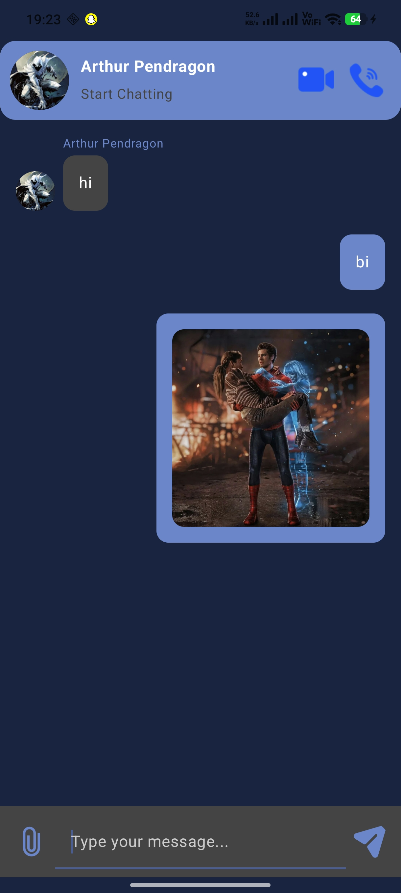
<br/>
<sub>Chat Interaction</sub>
</td>

</tr>

<tr>

<td align="center">
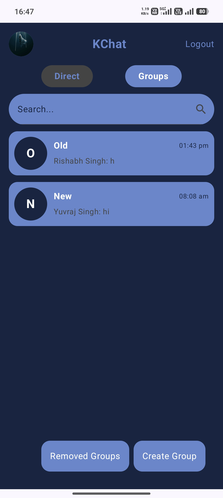
<br/>
<sub>Group Chat</sub>
</td>

<td align="center">

<br/>
<sub>Attachments</sub>
</td>

<td align="center">
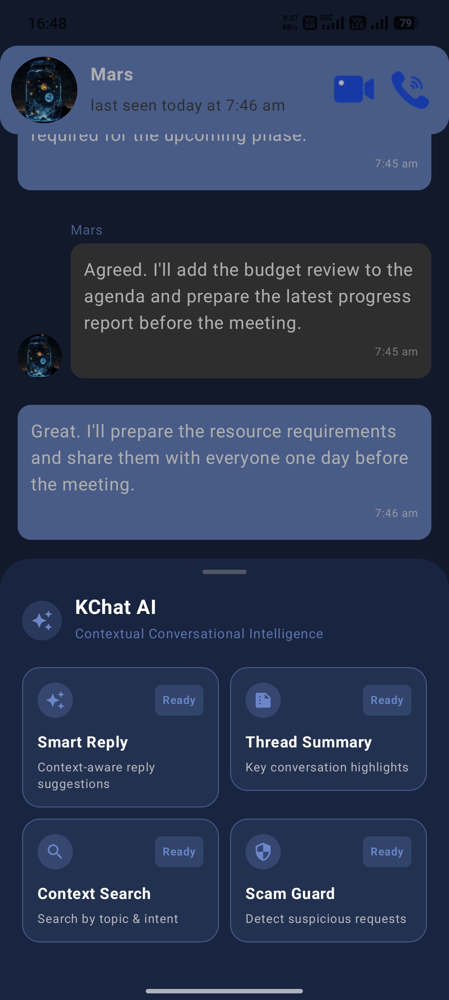
<br/>
<sub>KChat AI</sub>
</td>

<td align="center">

<br/>
<sub>Smart Reply</sub>
</td>

</tr>
</table>

</div>

</details>

<details>
<summary><b>🧠 AI Features</b></summary>

<br/>

<div align="center">

<table>
<tr>

<td align="center">

<br/>
<sub>Thread Summary</sub>
</td>

<td align="center">

<br/>
<sub>Context Search</sub>
</td>

<td align="center">

<br/>
<sub>Search Results</sub>
</td>

<td align="center">

<br/>
<sub>Scam Guard</sub>
</td>

</tr>
</table>

</div>

</details>

---

# 📥 Download KChat

<div align="center">

<a href="https://drive.google.com/drive/folders/1RB-iQOIvo52ucmvXW4rn5lG9Vo4NQUrR">

</a>

<br/>

<sub>
Latest signed Release APK • arm64-v8a
</sub>

</div>

---

# 🛠️ Build from Source

### Clone

```bash
git clone https://github.com/programmer-kunal/KChat.git
cd KChat
```

### Configure local properties

```properties
ZEGO_APP_ID=your_zego_app_id
ZEGO_APP_SIGN=your_zego_app_sign

SUPABASE_URL=your_supabase_url
SUPABASE_ANON_KEY=your_supabase_anon_key

RECAPTCHA_ENTERPRISE_SITE_KEY=your_recaptcha_site_key
```

### Add Firebase configuration

Place:

```text
google-services.json
```

inside:

```text
app/google-services.json
```

### Build Debug

```bash
./gradlew assembleDebug
```

### Build Release

```bash
./gradlew assembleRelease
```

> ⚠️ Never commit private keys, credentials, signing files, or secret configuration values to the repository.

---

# 🧪 Verification

### Communication

- ✅ Authentication
- ✅ Direct chat
- ✅ Group chat
- ✅ Friend system
- ✅ Presence
- ✅ Read receipts
- ✅ Replies
- ✅ Notifications
- ✅ Images
- ✅ Audio
- ✅ Video
- ✅ Documents / Files
- ✅ Voice calling
- ✅ Video calling

### AI

- ✅ Smart Reply
- ✅ Thread Summary
- ✅ Context Search
- ✅ Scam Guard

### Release

- ✅ Debug build
- ✅ Unit-test compilation
- ✅ Signed Release APK
- ✅ R8 / Minification
- ✅ Resource shrinking
- ✅ Firebase App Check
- ✅ Release security verification

---

# 🌟 The KChat Vision

```text
        MESSAGE
           ↓
        CONTEXT
           ↓
      INTELLIGENCE
           ↓
       ASSISTANCE
```

## **FROM CHAT → TO CONTEXT**

KChat is built around one idea:

> **Don't just deliver the conversation. Understand the conversation.**

---

# 👨‍💻 Developer

<div align="center">

<a href="https://github.com/programmer-kunal">


<br/>

### **Kunal**

**Android Developer • Application Builder**

<br/>


</a>

</div>

---

<div align="center">


<br/>

### 💬 KChat

**Real-Time Communication × Context Intelligence**

<br/>

<sub>Built with Kotlin • Jetpack Compose • Firebase • Supabase • Gemini • ZEGOCLOUD</sub>

<br/>

<a href="https://github.com/programmer-kunal/KChat">

</a>

</div>
