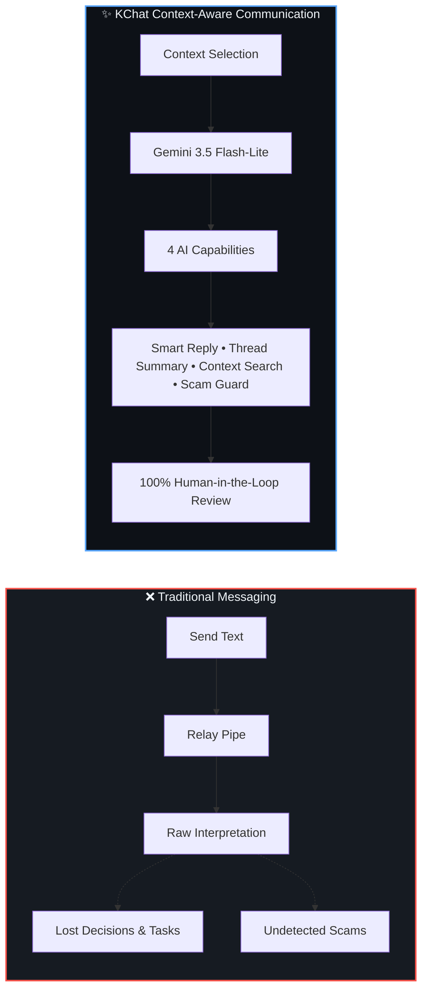
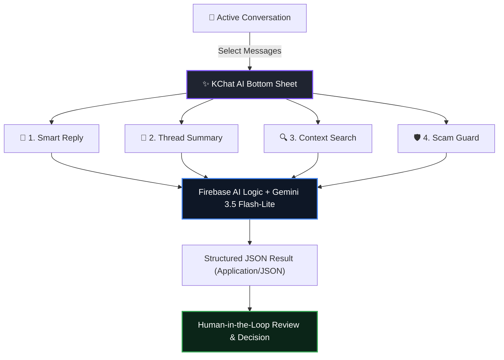
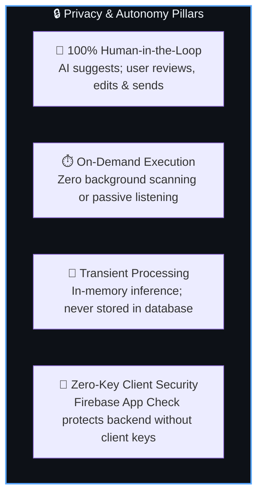
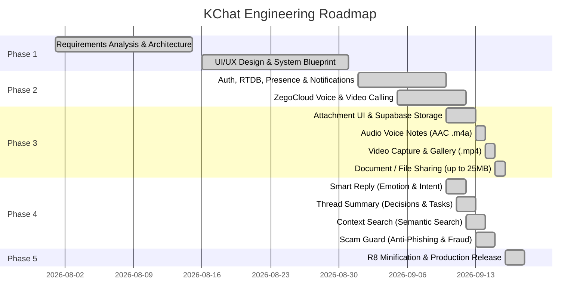

<div align="center">

  

  # 💭 KChat
  ### 🚀 *From Chat to Context — Intelligent Real-Time Communication Platform*

  <p align="center">
    <b>An AI-Powered, Production-Grade Android Communication System</b><br/>
    <i>Elevating traditional mobile messaging into Context-Aware Communication with on-demand Generative AI.</i>
  </p>

  <!-- Badges Grid -->
  <p align="center">
    <a href="https://developer.android.com"></a>
    <a href="https://kotlinlang.org"></a>
    <a href="https://developer.android.com/jetpack/compose"></a>
    <a href="https://firebase.google.com"></a>
    <br/>
    <a href="https://ai.google.dev"></a>
    <a href="https://supabase.com"></a>
    <a href="https://www.zegocloud.com"></a>
    <a href="https://cloud.google.com/recaptcha-enterprise"></a>
  </p>

  <br/>

  <!-- Hero CTA Download Box -->
  <table align="center" style="border-collapse: collapse; border: 2px solid #1A73E8; border-radius: 12px; background: #0D1117;">
    <tr>
      <td align="center" style="padding: 16px 24px;">
        <h4 style="margin: 0 0 10px 0; color: #58A6FF;">📲 Experience KChat on Your Android Device</h4>
        <a href="https://drive.google.com/drive/folders/1RB-iQOIvo52ucmvXW4rn5lG9Vo4NQUrR" target="_blank">
          
        </a>
        <br/><br/>
        <sub style="color: #8B949E;"><b>Direct Download:</b> Production Signed Release APK (<code>arm64-v8a</code>, Android 8.0+) • Protected by Firebase App Check & reCAPTCHA Enterprise</sub>
      </td>
    </tr>
  </table>

</div>

<br/>

---

## 📑 Table of Contents

- [🌟 The Core Paradigm: *From Chat to Context*](#-the-core-paradigm-from-chat-to-context)
- [🧠 The 4 Core AI Intelligence Features](#-the-4-core-ai-intelligence-features)
  - [1. Smart Reply (Emotion & Sentiment Intelligence)](#1--smart-reply-emotion--sentiment-intelligence)
  - [2. Thread Summary (Decisions, Action Items & Deadlines)](#2--thread-summary-decisions-action-items--deadlines)
  - [3. Context Search (Semantic Conversational Query)](#3--context-search-semantic-conversational-query)
  - [4. Scam Guard (Phishing & Fraud Shield)](#4--scam-guard-phishing--fraud-shield)
- [💬 Comprehensive Real-Time Communication](#-comprehensive-real-time-communication)
  - [Authentication & Onboarding](#authentication--onboarding)
  - [Direct & Group Messaging](#direct--group-messaging)
  - [Social Graph & Friend Management](#social-graph--friend-management)
  - [Rich Attachment & Multimedia System](#rich-attachment--multimedia-system)
  - [High-Definition Voice & Video Calling](#high-definition-voice--video-calling)
- [🛡️ Responsible AI & Privacy Principles](#️-responsible-ai--privacy-principles)
- [🏗️ System Architecture & Data Flow](#️-system-architecture--data-flow)
- [🛠️ Tools, Technologies & Hardware Requirements](#️-tools-technologies--hardware-requirements)
- [📅 Project Roadmap & Schedule](#-project-roadmap--schedule)
- [👨‍💻 Project Team & Academic Attribution](#-project-team--academic-attribution)
- [⭐ Community & Support](#-community--support)

---

<br/>

## 🌟 The Core Paradigm: *From Chat to Context*

Traditional mobile messaging applications operate strictly as **message-transfer pipes**:

```text
Traditional Model:   [ User Types ] ────► [ Network Transmission ] ────► [ User Reads ]
```

As personal and professional conversations grow in volume, critical information is routinely buried. Important decisions, action items, task deadlines, emotional tone, and even deceptive phishing attempts get lost in the noise of endless chat bubbles.

**KChat solves this fundamental problem by embedding an intelligence layer directly into the active communication workflow:**

```text
KChat Paradigm:      [ Transmit ] ──► [ Understand Context ] ──► [ Assist In-Situ ] ──► [ Empower User ]
```



### 📊 Comparative Analysis

| Evaluation Metric | 📱 Traditional Chat Apps | 🚀 KChat (Context-Aware Platform) |
| :--- | :--- | :--- |
| **System Focus** | Raw text/file delivery | Context understanding, safety analysis & conversational synthesis |
| **Long Discussions** | Manual scrolling through hundreds of messages | **Thread Summary**: Instant extraction of decisions, tasks & deadlines |
| **Information Search** | Rigid exact-string keyword matching | **Context Search**: Semantic intent-based natural language querying |
| **Conversational Nuance** | Guessed by the user; frequent misunderstandings | **Smart Reply**: Tone, sentiment, participant intent & urgency estimation |
| **User Protection** | Basic spam reporting after fraud occurs | **Scam Guard**: Proactive heuristic & semantic threat analysis on demand |
| **User Control** | Autocorrect or intrusive autonomous bots | **Strict Human-in-the-Loop**: AI suggests, user edits & manually sends |
| **Privacy & Security** | Background training or data harvesting | **Transient, In-Memory**: Zero background scanning; App Check protected |

---

<br/>

## 🧠 The 4 Core AI Intelligence Features

At the heart of KChat is the **Unified KChat AI Suite**, accessible via a single tap on the dedicated ✨ **KChat AI** bottom sheet in any direct or group conversation. Powered by **Google Gemini 3.5 Flash-Lite** via **Firebase AI Logic**, it provides four specialized cognitive assistants without requiring client-side API keys.



<div align="center">
  <table width="100%">
    <tr>
      <td align="center" width="50%">
        <b>✨ Unified KChat AI Engine Hub</b><br/><br/>
        <br/><br/>
        <sub>Central launcher providing instant access to all four on-demand intelligence features</sub>
      </td>
      <td align="center" width="50%">
        <b>⚡ Emotion & Suggestion Intelligence</b><br/><br/>
        <br/><br/>
        <sub>Smart Reply analysis card displaying tone, sentiment, intent, urgency and editable reply chips</sub>
      </td>
    </tr>
  </table>
</div>

<br/>

### 1. 🧠 Smart Reply (Emotion & Sentiment Intelligence)
> *Never misinterpret tone or struggle for the right words.*

- **Multi-Dimensional Dialogue Analysis**: Rather than offering generic 1-word replies, KChat evaluates the full conversational dialogue to determine:
  - **Tone**: Probabilistic tonal detection (*e.g., Friendly, Inquiring, Professional, Assertive, Anxious*).
  - **Sentiment**: Emotional polarity assessment (*Positive, Neutral, Negative*).
  - **Intent**: True communicative purpose (*e.g., Seeking Confirmation, Scheduling Meeting, Sharing Update*).
  - **Urgency Level**: Time-sensitivity rating (*Low, Medium, High*).
- **Contextual Suggestions**: Generates 2 to 4 contextually grounded, natural response chips.
- **One-Tap Composer Insertion**: Tapping any chip immediately populates the message composer `TextField`, allowing the user to review, edit, or append text before manually sending.

---

### 2. 📝 Thread Summary (Decisions, Action Items & Deadlines)
> *Catch up on 50+ messages in 5 seconds.*

<div align="center">
  <table width="100%">
    <tr>
      <td align="center" width="50%">
        <b>📝 Thread Summary Analysis</b><br/><br/>
        <br/><br/>
        <sub>Summarizes complex discussions into key points, decisions, action items, and task deadlines</sub>
      </td>
      <td align="center" width="50%">
        <b>🛡️ Scam Guard Security Shield</b><br/><br/>
        <br/><br/>
        <sub>Real-time scam risk scoring, threat indicators, fraud pattern analysis, and actionable advice</sub>
      </td>
    </tr>
  </table>
</div>

- **Executive Summary**: Generates a high-level overview of selected messages.
- **Structured Categorization**:
  - 📌 **Key Points**: Core topics and developments discussed.
  - ✅ **Decisions Made**: Explicit agreements reached between participants.
  - 📋 **Action Items & Tasks**: Who is responsible for what.
  - ⏰ **Deadlines & Timelines**: Explicit dates, times, or milestones mentioned in the conversation.
- **Single-Pass Inference**: Accomplished in a single Gemini Flash-Lite call, ensuring sub-second response times with zero lag.

---

### 3. 🔍 Context Search (Semantic Conversational Query)
> *Ask questions about your chat in natural language—no exact keywords required.*

<div align="center">
  <table width="100%">
    <tr>
      <td align="center" width="50%">
        <b>🔍 1. Natural Language Query Input</b><br/><br/>
        <br/><br/>
        <sub>Query dialog accepting plain-English questions about conversation history</sub>
      </td>
      <td align="center" width="50%">
        <b>🎯 2. Synthesized Answer & Citations</b><br/><br/>
        <br/><br/>
        <sub>AI-generated direct answer with message citations and jump-to-context references</sub>
      </td>
    </tr>
  </table>
</div>

- **Semantic Understanding**: Unlike traditional chat search tools that fail unless you remember the exact word, KChat's Context Search understands intent and concept.
  - *Example Query*: *"What time did Kunal say we are meeting for the project submission?"*
  - *Result*: Finds the exact message where Kunal said *"Let's connect at 4 PM in the lab"*, even though the word *"meeting"* was never used!
- **Direct Citations**: Highlights relevant message snippets so the user can verify the context immediately.

---

### 4. 🛡️ Scam Guard (Phishing & Fraud Shield)
> *Protect yourself from financial fraud, phishing links, and social engineering.*

- **Multi-Vector Threat Detection**: Analyzes suspicious messages for:
  - 🎣 **Phishing & Malicious Links**: Deceptive domains, lookalike URLs, or credential harvest attempts.
  - 💰 **Financial Scams & Fraud**: Fake payment proofs, urgent UPI requests, lottery/gift scams, or unauthorized transaction demands.
  - 🎭 **Impersonation & Social Engineering**: Authority figure spoofing, family emergency claims, or artificial urgency pressure.
- **Clear Risk Scoring**: Categorizes messages into distinct risk levels:
  - 🟢 **Safe / Low Risk**
  - 🟡 **Moderate Caution**
  - 🔴 **High / Critical Threat**
- **Actionable Safety Advice**: Outlines concrete precautionary steps (*e.g., "Do not click links", "Verify caller identity out-of-band", "Block & report"*).

---

<br/>

## 💬 Comprehensive Real-Time Communication

Beyond its AI layer, KChat is a **complete, full-stack real-time communication platform** designed to compete with modern messaging applications.

### Authentication & Onboarding
- **Google Sign-In**: Streamlined one-tap authentication via Google Identity Services.
- **Email & Password**: Robust Firebase Authentication with real-time field validation, password security checks, and error recovery.
- **Auto-Syncing Profile**: Instant user profile provisioning with profile photo, display name, and unique identity keys.

<div align="center">
  <table width="100%">
    <tr>
      <td align="center" width="33%">
        <b>🔐 Authentication Screen</b><br/><br/>
        <br/><br/>
        <sub>Modern Material 3 sign-in with Google & Email support</sub>
      </td>
      <td align="center" width="33%">
        <b>👤 User Profile & Settings</b><br/><br/>
        <br/><br/>
        <sub>Personalized avatar, status message, and presence management</sub>
      </td>
      <td align="center" width="33%">
        <b>👥 Multi-User Group Channels</b><br/><br/>
        <br/><br/>
        <sub>Group chat channels with multi-participant real-time sync</sub>
      </td>
    </tr>
  </table>
</div>

---

### Direct & Group Messaging
- **Firebase Realtime Database Pipeline**: Sub-100ms message delivery across mobile networks.
- **Accurate Presence System**: Real-time **Online** status indicator and timestamped **Last Seen** display built using Firebase `.info/connected` and atomic `onDisconnect` event handlers.
- **Dynamic Date Separators**: Smart chronological groupings (*Today*, *Yesterday*, or formatted date headers).
- **Unread Message Counters**: Reactive unread badges calculated dynamically per conversation.

<div align="center">
  <table width="100%">
    <tr>
      <td align="center" width="50%">
        <b>💬 Direct Chats Dashboard</b><br/><br/>
        <br/><br/>
        <sub>Live conversation list with active presence indicators and last message previews</sub>
      </td>
      <td align="center" width="50%">
        <b>💬 Active Conversations & History</b><br/><br/>
        <br/><br/>
        <sub>Organized conversation threads with real-time updates and unread badges</sub>
      </td>
    </tr>
  </table>
</div>

---

### Social Graph & Friend Management
- **User Discovery**: Real-time user lookup by name or email address.
- **Connection Requests**: Secure bidirectional friend request flow with instant notification dispatch.
- **Relationship Lifecycle**: Full mutual friendship state management (Send, Accept, Reject, Clear Chat, and Unfriend) without loss of message history.

<div align="center">
  <table width="100%">
    <tr>
      <td align="center" width="50%">
        <b>🔍 Find & Add Friends</b><br/><br/>
        <br/><br/>
        <sub>Live user discovery with instant friend request dispatch</sub>
      </td>
      <td align="center" width="50%">
        <b>📩 Connection Requests</b><br/><br/>
        <br/><br/>
        <sub>Review incoming connection requests with Accept and Reject actions</sub>
      </td>
    </tr>
  </table>
</div>

---

### Rich Attachment & Multimedia System
KChat features a complete **₹0 Cost multimedia pipeline** leveraging **Supabase Cloud Storage** (`chatter_images` bucket) alongside Android native media APIs:

1. 📷 **Camera Photos & Gallery Images**: Instant photo capture and multi-image picker with Coil asynchronous caching.
2. 🎙️ **Voice Notes / Audio Messaging**: Built-in `MediaRecorder` encoding AAC `.m4a` audio with live recording waveform timer, single-instance `MediaPlayer` playback, and seekable progress tracking.
3. 📹 **Video Messaging**: Up to 120s camera video recording (`MediaStore.ACTION_VIDEO_CAPTURE`) and gallery video selection, complete with pre-send video preview dialog, video thumbnail loader, and full-screen player.
4. 📎 **Document & File Sharing**: System `OpenDocument` picker supporting PDF, DOCX, XLSX, TXT, ZIP, etc. (up to 25MB safety validation), pre-send file metadata preview, download caching, and secure Android `FileProvider` + `Intent.ACTION_VIEW` dispatch.
5. ↩️ **Swipe-to-Reply & Quoted Replies**: Fluid touch gestures to quote text, audio, video, or documents with clickable reply navigation.

<div align="center">
  <table width="100%">
    <tr>
      <td align="center" width="33%">
        <b>📎 Attachment Engine Menu</b><br/><br/>
        <br/><br/>
        <sub>Polished Material 3 bottom sheet for Camera, Gallery, Audio, Video & Documents</sub>
      </td>
      <td align="center" width="33%">
        <b>💬 Rich Chatting Experience</b><br/><br/>
        <br/><br/>
        <sub>Seamless text & media bubbles with timestamps and read receipts</sub>
      </td>
      <td align="center" width="33%">
        <b>↩️ Quoted Replies & Media</b><br/><br/>
        <br/><br/>
        <sub>Interactive media playback, swipe-to-reply, and quoted preview cards</sub>
      </td>
    </tr>
  </table>
</div>

---

### High-Definition Voice & Video Calling
- **ZegoCloud Prebuilt Call UIKit**: Enterprise-grade WebRTC audio and video calling integrated directly into the chat top bar.
- **Call Invitations**: Real-time ringing notifications, incoming call dialogs, multi-resolution camera streams, and background call rejection.
- **Optimized Bandwidth**: Dynamic bitrate adaptation ensuring uninterrupted audio/video even on fluctuating 4G/5G mobile connections.

---

<br/>

## 🛡️ Responsible AI & Privacy Principles

KChat was engineered strictly following **Responsible AI** and user-first privacy principles:



- **Strictly Human-in-the-Loop**: The AI **never sends messages autonomously**. The user maintains total agency to inspect, edit, or discard any AI-generated text or recommendation.
- **No Background Monitoring**: Conversations are **never passively monitored, logged, or scraped**. Inference triggers exclusively when the user manually selects messages and taps an AI option.
- **Zero Client-Side API Keys**: Eliminates the danger of reverse-engineered API keys. Android client communicates through **Firebase App Check** with **reCAPTCHA Enterprise**, which cryptographically verifies app identity before granting access to Firebase AI Logic.
- **Transient In-Memory Results**: Summaries, searches, and safety ratings are computed in volatile memory and presented directly to the user—they are never committed to permanent database records.

---

<br/>

## 🏗️ System Architecture & Data Flow

KChat follows a modular **Model-View-ViewModel (MVVM)** pattern combined with Clean Architecture principles:

```mermaid
flowchart TD
    subgraph UI_Layer["🎨 UI Presentation Layer (Jetpack Compose + Material 3)"]
        ChatScreen["ChatScreen.kt"]
        DirectChatScreen["DirectChatScreen.kt"]
        HomeScreen["HomeScreen.kt"]
        AttachmentSheet["AttachmentBottomSheet.kt"]
        AISheet["SmartReply / ThreadSummary / ContextSearch / ScamGuard Sheets"]
    end

    subgraph MVVM_Layer["⚙️ Application Logic Layer (ViewModels + Coroutines + StateFlow)"]
        ChatVM["ChatViewModel"]
        HomeVM["HomeViewModel"]
        DirectChatVM["DirectChatViewModel"]
        SmartReplyVM["SmartReplyViewModel"]
    end

    subgraph Core_Services["🔌 Core Service & Utility Layer"]
        FirebaseAI["Firebase AI Logic (Gemini 3.5 Flash-Lite)"]
        SupabaseUtils["SupabaseStorageUtils (Media & Files)"]
        AudioHelper["AudioRecorderHelper & AudioPlayerHelper"]
        VideoHelper["VideoPlayerHelper & VideoUtils"]
        FileHelper["FileUtils & FileProvider"]
        PresenceManager["Realtime Presence (.info/connected)"]
    end

    subgraph Cloud_Infrastructure["☁️ Cloud Infrastructure & External Services"]
        FB_Auth["Firebase Auth (Identity)"]
        FB_RTDB["Firebase Realtime Database"]
        FB_FCM["Firebase Cloud Messaging (FCM)"]
        FB_AppCheck["Firebase App Check (reCAPTCHA Enterprise)"]
        Supa_Storage["Supabase Cloud Storage (Free Tier)"]
        Zego_RTC["ZegoCloud RTC (Voice & Video)"]
    end

    UI_Layer --> MVVM_Layer
    MVVM_Layer --> Core_Services
    Core_Services --> Cloud_Infrastructure

    style UI_Layer fill:#161B22,stroke:#58A6FF,stroke-width:2px,color:#F0F6FC
    style MVVM_Layer fill:#161B22,stroke:#7F52FF,stroke-width:2px,color:#F0F6FC
    style Core_Services fill:#161B22,stroke:#3ECF8E,stroke-width:2px,color:#F0F6FC
    style Cloud_Infrastructure fill:#161B22,stroke:#FFCA28,stroke-width:2px,color:#F0F6FC
```



### ⚡ AI Pipeline: Single-Request Prompt Optimization
To ensure minimal latency and zero quota exhaustion, every AI operation is crafted as a **single-request prompt pass**:

1. **Context Extraction**: Selected messages are chronologically sorted and labeled (`Me: ...` vs `Other: ...`).
2. **Payload Dispatch**: Single call to `GenerativeModel.generateContent(...)` through Firebase AI Logic.
3. **App Check Attestation**: Automatic cryptographic device validation eliminates unauthorized backend access.
4. **Local Parsing**: Safe JSON deserialization via Android's built-in `JSONObject` with comprehensive fallback handling.
5. **Interactive Rendering**: Instant reactive UI updates within custom Jetpack Compose bottom sheets.

---

<br/>

## 🛠️ Tools, Technologies & Hardware Requirements

### 💻 Software & Library Stack
| Component | Technology | Description |
| :--- | :--- | :--- |
| **Language** | **Kotlin 2.0** | Modern, expressive, type-safe programming language for Android |
| **UI Toolkit** | **Jetpack Compose + Material 3** | Declarative UI framework delivering reactive, fluid user interfaces |
| **Dependency Injection** | **Dagger Hilt** | Standard compile-time dependency injection for Android |
| **Asynchronous Engine** | **Kotlin Coroutines & Flow** | First-class structured concurrency and reactive state management |
| **Authentication** | **Firebase Auth & Google Sign-In** | Secure user registration, credential management, and OAuth flows |
| **Realtime Database** | **Firebase Realtime Database (RTDB)** | Low-latency JSON data synchronization with offline disk persistence |
| **Push Notifications** | **Firebase Cloud Messaging (FCM)** | High-priority background messaging notifications |
| **App Integrity** | **Firebase App Check & reCAPTCHA** | Backend attestation guarding API access from unauthorized devices |
| **Generative AI** | **Firebase AI Logic + Gemini 3.5 Flash-Lite** | Advanced multi-modal generative language intelligence |
| **Media Cloud Storage** | **Supabase Storage** | S3-compatible cloud object storage for multimedia and files |
| **Voice & Video Calling** | **ZegoCloud Call UIKit** | Low-latency WebRTC audio/video call service |
| **Image Loading** | **Coil Compose** | Lightweight, Kotlin-first asynchronous image loader with memory caching |
| **Compiler / Minifier** | **R8 / ProGuard** | Bytecode optimization, class obfuscation, and dead-code stripping |

### 🖥️ Hardware & Development Environment Requirements
- **Development OS**: Windows 10/11, macOS, or Linux
- **IDE**: Android Studio Ladybug / Meerkat (or newer) with Android SDK Build-Tools 36.0.0
- **JDK Version**: Java Development Kit (JDK) 11 / 21
- **Device Requirements**: Physical Android smartphone or emulator running **Android 8.0 (API Level 26)** or higher with active Internet connectivity.

---

<br/>

## 📅 Project Roadmap & Schedule

KChat was planned, developed, and verified through a structured 5-phase engineering lifecycle:

```text
Phase 1: Planning & Architecture Analysis  ✅ [Complete]
Phase 2: Real-Time Communication Engine    ✅ [Complete - Auth, RTDB, Presence, Calling, FCM]
Phase 3: Rich Multimedia & Attachments     ✅ [Complete - Voice Notes, Video, Files up to 25MB]
Phase 4: AI Intelligence Suite            ✅ [Complete - Smart Reply, Thread Summary, Context Search, Scam Guard]
Phase 5: Release Hardening & Verification  ✅ [Complete - R8 Minification, Signed Release Checkpoint]
```



---

<br/>

## 👨‍💻 Project Team & Academic Attribution

This project is submitted in partial fulfillment of the award of **Bachelor of Technology in Information Technology**:

- **Project Group ID**: `2023-27/IT/IT-47`
- **Institution**: Department of Information Technology, **Ajay Kumar Garg Engineering College (AKGEC)**, Ghaziabad
- **Affiliated University**: **Dr. A.P.J. Abdul Kalam Technical University (AKTU)**, Lucknow
- **Faculty Guide & Mentor**: **Mr. Pradeep Tripathi**

### 👥 Project Members & Authors

<table align="center" width="100%">
  <tr>
    <td align="center" width="33%">
      <a href="https://github.com/programmer-kunal">
        
        <br/><br/>
        <b>Kunal</b>
      </a>
      <br/>
      <sub>Roll No: <b>2300270130102</b></sub>
      <br/>
      <sub>Lead Android, AI & Systems Developer</sub>
      <br/><br/>
      <a href="https://github.com/programmer-kunal">
        
      </a>
    </td>
    <td align="center" width="33%">
      
      <br/><br/>
      <b>Krishna Bhushan</b>
      <br/>
      <sub>Roll No: <b>2300270130099</b></sub>
      <br/>
      <sub>B.Tech Information Technology</sub>
      <br/><br/>
      
    </td>
    <td align="center" width="33%">
      
      <br/><br/>
      <b>Harsh Bardhan Mishra</b>
      <br/>
      <sub>Roll No: <b>2300270130078</b></sub>
      <br/>
      <sub>B.Tech Information Technology</sub>
      <br/><br/>
      
    </td>
  </tr>
</table>

---

<br/>

## 🛠️ Building & Running from Source

```bash
# 1. Clone the repository
git clone https://github.com/programmer-kunal/KChat.git
cd KChat

# 2. Configure credentials
cp local.properties.example local.properties
# Edit local.properties and add:
# ZEGO_APP_ID=your_zego_app_id
# ZEGO_APP_SIGN=your_zego_app_sign
# SUPABASE_URL=your_supabase_url
# SUPABASE_ANON_KEY=your_supabase_anon_key
# RECAPTCHA_ENTERPRISE_SITE_KEY=your_recaptcha_site_key

# 3. Add google-services.json
# Place your project's google-services.json inside the app/ directory

# 4. Compile and assemble debug build
./gradlew assembleDebug

# 5. Build signed production release APK (arm64-v8a)
./gradlew assembleRelease
```

---

<br/>

## ⭐ Community & Support

If KChat has inspired your work or provided insights into building modern AI-powered Android applications:
- ⭐ **Star this repository** to support active open-source development!
- 🍴 **Fork the project** and experiment with extending the intelligence layers.
- 💬 **Feedback & Contributions**: Open an issue or submit a pull request!

<br/>

<div align="center">
  
  <br/>
  <b>KChat: From Chat to Context</b>
  <br/>
  <sub>Designed with ❤️ by Kunal, Krishna Bhushan, and Harsh Bardhan Mishra • AKGEC IT</sub>
</div>
