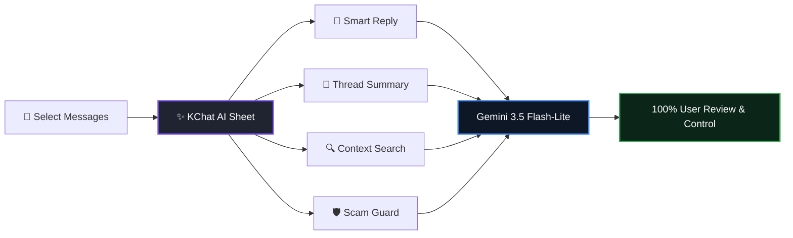
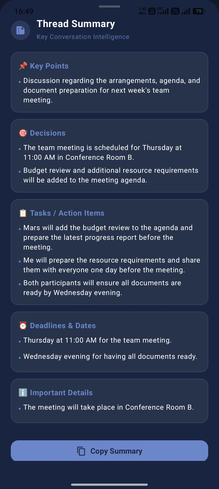
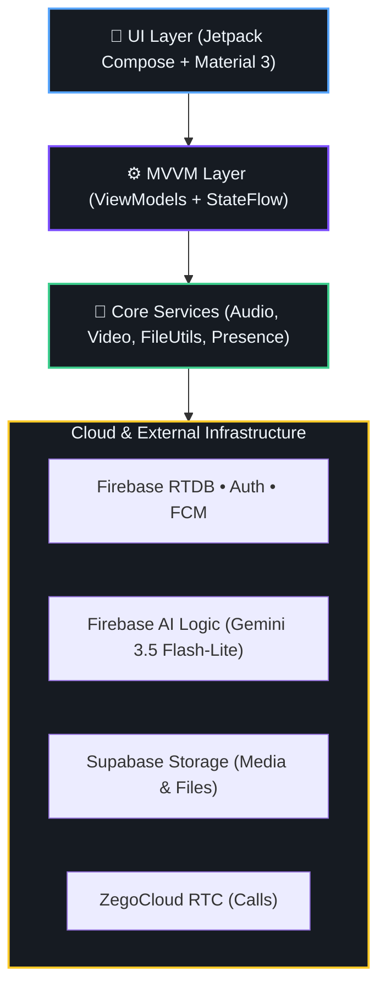

<div align="center">

  

  # 💭 KChat
  ### 🚀 *From Chat to Context — Intelligent Real-Time Communication Platform*

  <p align="center">
    <b>A Modern, Context-Aware Android Communication System</b><br/>
    <i>Elevating mobile messaging by pairing instant communication with on-demand Generative AI.</i>
  </p>

  <p align="center">
    <a href="https://developer.android.com"></a>
    <a href="https://kotlinlang.org"></a>
    <a href="https://developer.android.com/jetpack/compose"></a>
    <a href="https://firebase.google.com"></a>
    <br/>
    <a href="https://ai.google.dev"></a>
    <a href="https://supabase.com"></a>
    <a href="https://www.zegocloud.com"></a>
    <a href="https://cloud.google.com/recaptcha-enterprise"></a>
  </p>

  <br/>

  <!-- Hero CTA Download Box -->
  <table align="center" style="border-collapse: collapse; border: 2px solid #1A73E8; border-radius: 12px; background: #0D1117;">
    <tr>
      <td align="center" style="padding: 14px 24px;">
        <h4 style="margin: 0 0 8px 0; color: #58A6FF;">📲 Experience KChat on Android</h4>
        <a href="https://drive.google.com/drive/folders/1RB-iQOIvo52ucmvXW4rn5lG9Vo4NQUrR" target="_blank">
          
        </a>
        <br/><br/>
        <sub style="color: #8B949E;"><b>Direct Download:</b> Production Signed Release APK (<code>arm64-v8a</code>, Android 8.0+) • Protected by Firebase App Check & reCAPTCHA Enterprise</sub>
      </td>
    </tr>
  </table>

</div>

<br/>

---

## 🌟 The Core Paradigm: *From Chat to Context*

Traditional messaging applications are **message-transfer pipes** where conversations quickly become noisy, burying crucial decisions, deadlines, emotional nuances, and scam attempts:

$$\mathbf{Traditional:} \quad \text{Send} \;\longrightarrow\; \text{Receive} \;\longrightarrow\; \text{Reply}$$

$$\mathbf{KChat:} \quad \text{Send} \;\longrightarrow\; \mathbf{Understand\;Context} \;\longrightarrow\; \mathbf{Assist\;In\text{-}Situ} \;\longrightarrow\; \text{Empower\;User}$$

| Dimension | 📱 Traditional Chat Apps | 🚀 KChat (Context-Aware) |
| :--- | :--- | :--- |
| **System Focus** | Raw text relay pipe | Context understanding, safety analysis & synthesis |
| **Long Discussions** | Tedious scrolling through hundreds of messages | **Thread Summary**: Instant extraction of decisions, tasks & deadlines |
| **Search Engine** | Exact-string keyword matching | **Context Search**: Semantic intent-based natural language query |
| **Conversational Nuance** | Guessed by user; tone misunderstood | **Smart Reply**: Tone, sentiment, intent & urgency estimation |
| **Security Shield** | Reactive spam reporting after fraud occurs | **Scam Guard**: Real-time phishing, fraud & social engineering detection |
| **User Control** | Generic bots or autocorrect | **100% Human-in-the-Loop**: AI suggests, user edits & manually sends |
| **Data Privacy** | Background data harvesting / training | **Transient In-Memory**: Zero background scanning; App Check protected |

---

<br/>

## 🧠 The 4 Core AI Intelligence Features

KChat features a unified intelligence suite powered by **Google Gemini 3.5 Flash-Lite** via **Firebase AI Logic**, accessible via a single tap on the ✨ **KChat AI** bottom sheet without exposing client-side API keys.



<div align="center">
  <table width="100%">
    <tr>
      <td align="center" width="50%">
        <b>✨ KChat AI Engine Hub</b><br/><br/>
        <br/><br/>
        <sub>Central sheet providing on-demand access to all 4 intelligence features</sub>
      </td>
      <td align="center" width="50%">
        <b>🧠 1. Smart Reply</b><br/><br/>
        <br/><br/>
        <sub>Analyzes tone, sentiment, intent & urgency with editable reply suggestions</sub>
      </td>
    </tr>
  </table>
</div>

### 1. 🧠 Smart Reply (Emotion & Sentiment Intelligence)
- **Multi-Factor Analysis**: Detects **Likely Tone** (*Friendly, Inquiring, Professional, Anxious*), **Sentiment** (*Positive, Neutral, Negative*), **Participant Intent**, and **Urgency** (*Low, Medium, High*).
- **Context-Aware Suggestions**: Generates 2 to 4 natural, concise reply options.
- **One-Tap Insertion**: Tapping any chip drops the text into the active composer for review, editing, or manual sending.

---

<div align="center">
  <table width="100%">
    <tr>
      <td align="center" width="50%">
        <b>📝 2. Thread Summary</b><br/><br/>
        <br/><br/>
        <sub>Extracts key takeaways, decisions, action items, and task deadlines</sub>
      </td>
      <td align="center" width="50%">
        <b>🛡️ 4. Scam Guard Shield</b><br/><br/>
        <br/><br/>
        <sub>Real-time scam risk scoring, threat indicators, and actionable safety advice</sub>
      </td>
    </tr>
  </table>
</div>

### 2. 📝 Thread Summary (Decisions, Action Items & Deadlines)
- **Executive Overview**: Distills lengthy message threads in seconds.
- **Structured Extraction**: Automatically categorizes **Key Points**, **Decisions Made**, **Assigned Tasks**, and **Deadlines & Milestones**.
- **Single-Pass Inference**: High-speed, structured JSON generation with zero delay.

---

### 3. 🔍 Context Search (Semantic Conversational Query)
> *Ask questions about your chat in natural language — no exact keywords needed.*

<div align="center">
  <table width="100%">
    <tr>
      <td align="center" width="50%">
        <b>🔍 1. Natural Language Query</b><br/><br/>
        <br/><br/>
        <sub>Ask plain questions about past conversations</sub>
      </td>
      <td align="center" width="50%">
        <b>🎯 2. Synthesized Answer & Citations</b><br/><br/>
        <br/><br/>
        <sub>Direct answers with message citations and jump-to-context references</sub>
      </td>
    </tr>
  </table>
</div>

- **Concept Understanding**: Finds answers even if the exact words weren't used (*e.g., asking "When is our submission?" finds "Let's submit tomorrow at 2 PM"*).
- **Direct Citations**: References original messages for instant verification.

---

### 4. 🛡️ Scam Guard (Phishing & Fraud Shield)
- **Multi-Threat Detection**: Scans for phishing links, financial fraud, urgent payment demands, and social engineering.
- **Risk Scoring**: Categorizes messages into **Low / Safe**, **Moderate Caution**, or **Critical Threat**.
- **Actionable Guidance**: Provides clear safety advice (*e.g., "Do not click links", "Verify sender out-of-band"*).

> [!NOTE]
> **Responsible AI Guarantee**: Strictly **100% Human-in-the-Loop**. AI never sends messages automatically. Processing is on-demand, transient, and in-memory with zero background scanning.

---

<br/>

## 💬 Full-Stack Real-Time Communication

KChat combines its AI layer with a complete, modern Android communication infrastructure:

### 1. Onboarding, Profiles & Group Channels
<div align="center">
  <table width="100%">
    <tr>
      <td align="center" width="33%">
        <b>🔐 Authentication</b><br/><br/>
        <br/><br/>
        <sub>Google Sign-In & Email/Password</sub>
      </td>
      <td align="center" width="33%">
        <b>👤 User Profile</b><br/><br/>
        <br/><br/>
        <sub>Avatar, status & account controls</sub>
      </td>
      <td align="center" width="33%">
        <b>👥 Group Channels</b><br/><br/>
        <br/><br/>
        <sub>Multi-user real-time channels</sub>
      </td>
    </tr>
  </table>
</div>

---

### 2. Direct Messaging & Social Discovery
<div align="center">
  <table width="100%">
    <tr>
      <td align="center" width="25%">
        <b>💬 Direct Chats</b><br/><br/>
        <br/><br/>
        <sub>Live presence & previews</sub>
      </td>
      <td align="center" width="25%">
        <b>💬 Chat Threads</b><br/><br/>
        <br/><br/>
        <sub>Unread badges & history</sub>
      </td>
      <td align="center" width="25%">
        <b>🔍 Add Friends</b><br/><br/>
        <br/><br/>
        <sub>Live user discovery</sub>
      </td>
      <td align="center" width="25%">
        <b>📩 Friend Requests</b><br/><br/>
        <br/><br/>
        <sub>Accept & reject requests</sub>
      </td>
    </tr>
  </table>
</div>

---

### 3. Rich Attachments & Interactive Messaging
<div align="center">
  <table width="100%">
    <tr>
      <td align="center" width="33%">
        <b>📎 Attachment Menu</b><br/><br/>
        <br/><br/>
        <sub>Camera, Gallery, Audio, Video & Docs</sub>
      </td>
      <td align="center" width="33%">
        <b>💬 Chat Experience</b><br/><br/>
        <br/><br/>
        <sub>Timestamps, read receipts & bubbles</sub>
      </td>
      <td align="center" width="33%">
        <b>↩️ Quoted Replies & Media</b><br/><br/>
        <br/><br/>
        <sub>Swipe-to-reply & inline media player</sub>
      </td>
    </tr>
  </table>
</div>

- **₹0 Multimedia Storage**: Powered by Supabase Storage (`chatter_images` bucket).
- 🎙️ **Voice Notes**: AAC `.m4a` recording with waveform timer and single-instance playback.
- 📹 **Video Messaging**: 120s camera video recording, gallery picker, and full-screen player.
- 📎 **Document Sharing**: PDF, DOCX, XLSX, TXT, ZIP up to 25MB via `FileProvider` + `Intent.ACTION_VIEW`.
- 📞 **ZegoCloud Calling**: Crystal-clear 1-to-1 WebRTC HD voice and video calling.
- 🔔 **FCM Push Notifications**: Instant background alerts for messages and calls.

---

<br/>

## 🏗️ System Architecture & Engineering



### 💻 Tech Stack Summary
- **Android**: Kotlin 2.0 • Jetpack Compose • Material Design 3 • Dagger Hilt • Coroutines & Flow
- **Cloud & Realtime**: Firebase Realtime Database • Firebase Authentication • Firebase Cloud Messaging (FCM)
- **Security & Integrity**: Firebase App Check with reCAPTCHA Enterprise • R8 Minification
- **AI Engine**: Google Gemini 3.5 Flash-Lite via Firebase AI Logic
- **Storage & Calling**: Supabase Cloud Storage • ZegoCloud Call UIKit

---

<br/>

## 🛠️ Building & Running from Source

```bash
# 1. Clone repository
git clone https://github.com/programmer-kunal/KChat.git
cd KChat

# 2. Configure credentials
cp local.properties.example local.properties
# Set: ZEGO_APP_ID, ZEGO_APP_SIGN, SUPABASE_URL, SUPABASE_ANON_KEY, RECAPTCHA_ENTERPRISE_SITE_KEY

# 3. Add Firebase configuration
# Place your google-services.json inside app/

# 4. Build and run
./gradlew assembleDebug
```

---

<br/>

## 👨‍💻 Author & Maintainer

<table align="center">
  <tr>
    <td align="center">
      <a href="https://github.com/programmer-kunal">
        
        <br/><br/>
        <b>Kunal</b>
      </a>
      <br/>
      <sub>Lead Android & AI Systems Developer</sub>
      <br/><br/>
      <a href="https://github.com/programmer-kunal" target="_blank">
        
      </a>
    </td>
  </tr>
</table>

---

<br/>

## ⭐ Support & Community

If you find KChat inspiring:
- ⭐ **Star this repository** to show support!
- 🍴 **Fork the project** and build your own AI-powered features.
- 💬 **Feedback**: Open an Issue or submit a Pull Request!

<br/>

<div align="center">
  
  <br/>
  <b>KChat: From Chat to Context</b>
  <br/>
  <sub>Designed & Developed with ❤️ by Kunal</sub>
</div>
