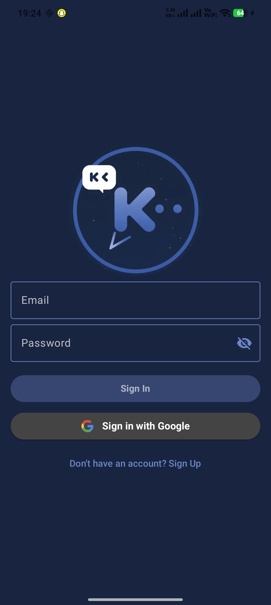
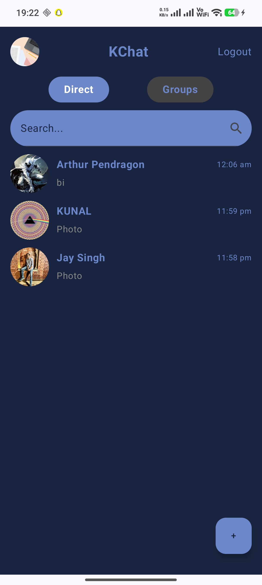
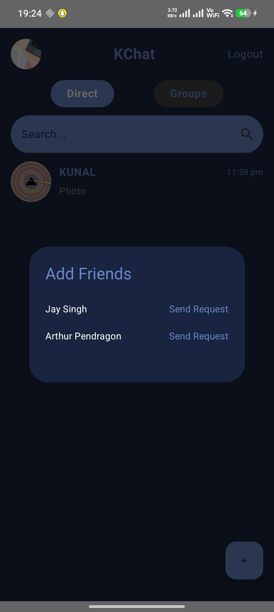
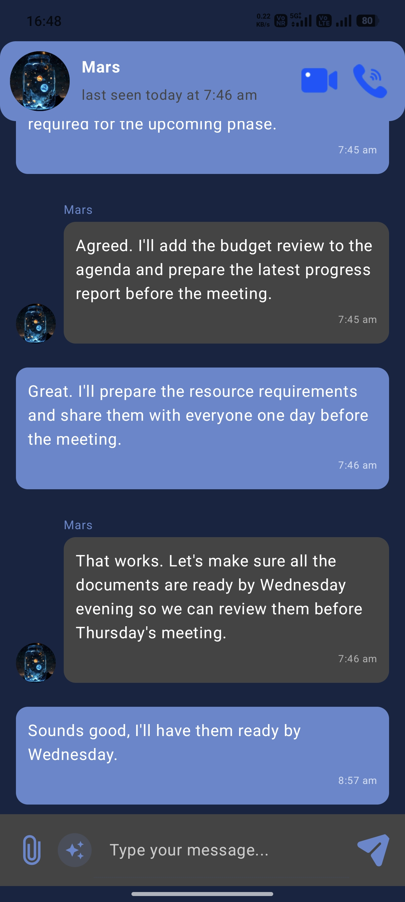
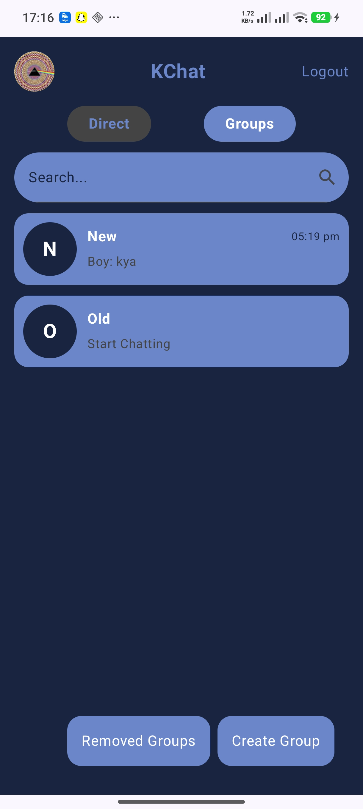

```md
<h1 align="center">💬 KChat</h1>

<h3 align="center">
Modern Real-Time Android Chat Application built with Kotlin & Jetpack Compose
</h3>

<p align="center">
  
  
  
  
</p>

---

# ✨ Overview

KChat is a modern real-time messaging application built using **Kotlin**, **Jetpack Compose**, and **Firebase** following **MVVM architecture**.

The app focuses on:
- Real-time communication
- Clean modern UI
- Smooth user experience
- Image sharing
- Group messaging
- Firebase cloud integration

---

# 🚀 Features

✅ Real-time Personal Chat  
✅ Real-time Group Chat  
✅ Firebase Authentication  
✅ Google Sign-In  
✅ Image Sharing  
✅ Friend Request System  
✅ Search Users  
✅ Profile Customization  
✅ Cloud Storage Integration  
✅ Push Notifications (FCM)  
✅ Modern Jetpack Compose UI  
✅ MVVM Architecture  
✅ Responsive Design  

---

# 📱 Download APK

<p align="center">

<a href="YOUR_APK_LINK_HERE">
  
</a>

</p>

---

# 🛠️ Tech Stack

| Technology | Usage |
|------------|-------|
| Kotlin | Main Language |
| Jetpack Compose | UI Development |
| Firebase Auth | Authentication |
| Firebase Realtime Database | Real-time Messaging |
| Firebase Cloud Storage | Image Storage |
| Firebase Cloud Messaging | Push Notifications |
| MVVM | Architecture Pattern |
| Volley | Network Operations |

---

# 📸 App Screenshots

## 🔐 Authentication

<table>
<tr>
<td align="center">

</td>
</tr>
</table>

---

## 🏠 Main Features

<table>
<tr>

<td align="center">
<h3>Home Screen</h3>

</td>

<td align="center">
<h3>Add Friends</h3>

</td>

<td align="center">
<h3>Friend Requests</h3>

</td>

</tr>
</table>

---

## 💬 Chat Experience

<table>
<tr>

<td align="center">
<h3>Personal Chat</h3>

</td>

<td align="center">
<h3>Group Chat</h3>

</td>

<td align="center">
<h3>Profile Options</h3>

</td>

</tr>
</table>

---

# ⚡ Performance Highlights

- Optimized Firebase realtime updates
- Smooth Compose animations
- Lightweight modern UI
- Responsive layouts
- Efficient state management
- Fast image loading experience

---

# 🧠 Architecture

KChat follows **MVVM (Model-View-ViewModel)** architecture for:
- Better scalability
- Cleaner codebase
- Easier maintenance
- Improved state handling

---

# 🔥 Future Improvements

- Voice Messages
- Video Calling
- Message Reactions
- Chat Themes
- End-to-End Encryption
- AI Features
- Message Deletion Sync
- Online/Typing Indicators

---

# 👨‍💻 Developer

### Kunal

Android Developer passionate about:
- Kotlin Development
- Jetpack Compose
- Firebase Integration
- Modern Android UI/UX
- AI Integrated Applications

---

# ⭐ Support

If you like this project:

⭐ Star the repository  
🍴 Fork the project  
📢 Share with others  

---

<h3 align="center">
Made with ❤️ using Kotlin & Firebase
</h3>
```
