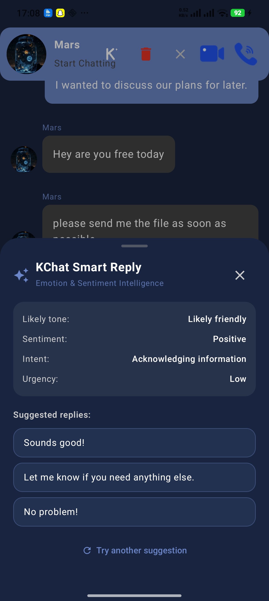
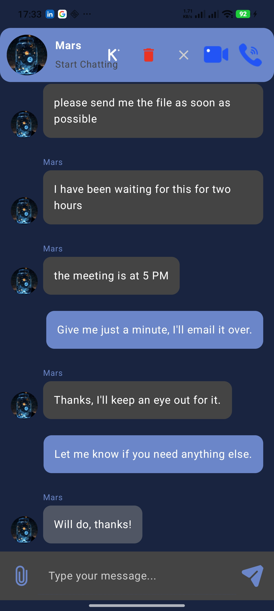
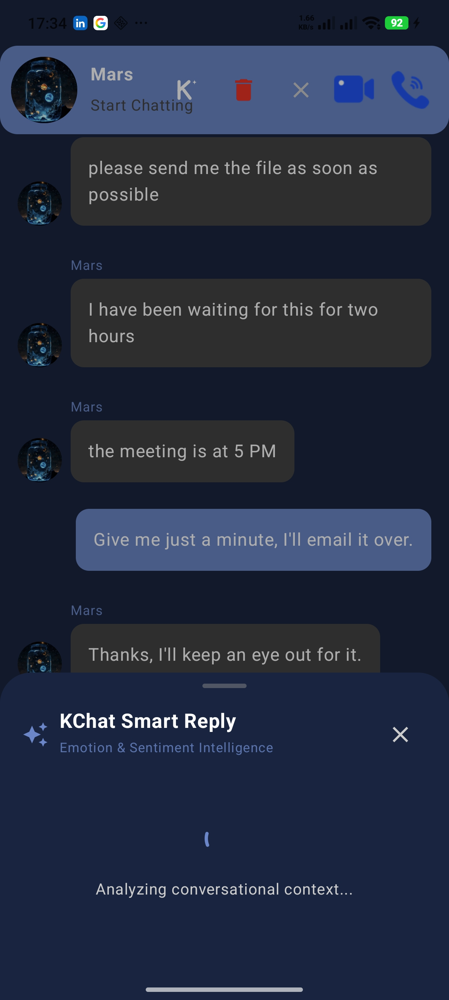
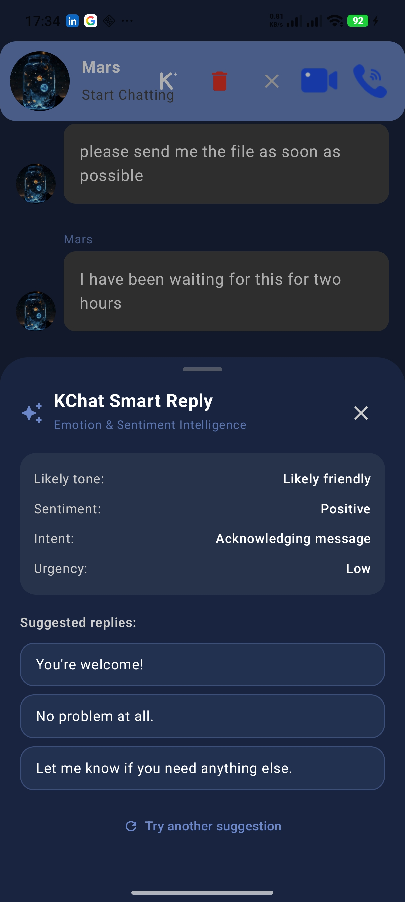

# 💬 KChat

### 🚀 From Chat to Context

> **KChat is a modern real-time Android communication platform that combines messaging, media sharing, voice/video calling, and contextual AI assistance — built with Kotlin, Jetpack Compose, Firebase, and Gemini.**

KChat started as a real-time communication application and evolved toward a **context-centric communication experience**, where AI can understand conversational context and assist users directly inside the chat workflow.

---

## ✨ What Makes KChat Different?

Most messaging applications focus on:

**Send → Receive → Reply**

KChat moves toward:

**Send → Understand → Assist → Reply**

The goal is not to replace the user.

The goal is to provide **context-aware assistance while keeping the user in control.**

---

# 🤖 KChat Smart Reply

## Emotion & Sentiment Intelligence

KChat Smart Reply is an AI-powered conversational assistance feature designed to understand the context of selected messages and generate concise, natural reply suggestions.

Instead of forcing users to manually formulate every response, KChat analyzes the selected conversation and considers:

- 🧠 Conversational context
- 😊 Likely tone
- 💭 Sentiment
- 🎯 Intent
- ⚡ Urgency

It then generates multiple reply suggestions that the user can review, edit, and send.

### 🔐 Human Always in Control

KChat Smart Reply **never automatically sends an AI-generated message.**

The user always:

**Selects → Reviews → Edits → Sends**

This keeps AI assistance useful while preserving human control over communication.

---

## 📱 Smart Reply in Action

<p align="center">
  
</p>

<p align="center">
  <b>KChat Smart Reply — Context-aware AI assistance inside the conversation</b>
</p>

---

## 🧠 How Smart Reply Works

### 1️⃣ Select Conversational Context

Long-press a message inside a direct conversation and select one or more messages.

<p align="center">
  
</p>

KChat uses the selected messages as the conversational context for AI analysis.

---

### 2️⃣ Understand the Conversation

KChat analyzes the selected context and estimates:

| Intelligence | Purpose |
|---|---|
| 😊 Tone | Understands the likely communication tone |
| 💭 Sentiment | Identifies the overall sentiment |
| 🎯 Intent | Determines what the conversation is trying to communicate |
| ⚡ Urgency | Estimates whether the response requires immediate attention |

The result is presented as a **probabilistic interpretation**, rather than claiming to know the user's actual emotional state.

<p align="center">
  
</p>

---

### 3️⃣ Generate Natural Reply Suggestions

KChat generates several concise reply options based on the selected conversational context.

<p align="center">
  
</p>

The user can choose the suggestion that best fits the conversation.

The selected reply is inserted into the existing message composer, where it can be edited before sending.

---

# 🔄 Smart Reply Workflow

```text
┌─────────────────────┐
│  Select Messages    │
└──────────┬──────────┘
           ↓
┌─────────────────────┐
│ Analyze Context     │
│ • Tone              │
│ • Sentiment         │
│ • Intent            │
│ • Urgency           │
└──────────┬──────────┘
           ↓
┌─────────────────────┐
│ Generate Suggestions│
└──────────┬──────────┘
           ↓
┌─────────────────────┐
│ User Reviews / Edits│
└──────────┬──────────┘
           ↓
┌─────────────────────┐
│ Existing Send Button│
└─────────────────────┘
